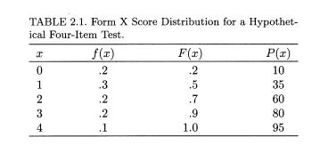

<!-- README.md is generated from README.Rmd. Please edit that file -->

```{r, include = FALSE}
knitr::opts_chunk$set(
  collapse = TRUE,
  comment = "#>",
  fig.path = "man/figures/README-",
  out.width = "100%"
)
```

# kvordun

<!-- badges: start -->

<!-- badges: end -->

The goal of kvordun is to ...

## Installation

You can install the development version of kvordun from [GitHub](https://github.com/) with:

``` r
# install.packages("devtools")
devtools::install_github("auv2/kvordun")
```

## Dæmi

Tekið úr Kolen og Brennan (2004) bls 40



```{r example}
library(kvordun)
value <- c(0,0,1,1,1,2,2,3,3,4)
reikna_hlutfall(value, kvardi = 0:4, punktar = 1)

```

You'll still need to render `README.Rmd` regularly, to keep `README.md` up-to-date. `devtools::build_readme()` is handy for this. You could also use GitHub Actions to re-render `README.Rmd` every time you push. An example workflow can be found here: <https://github.com/r-lib/actions/tree/v1/examples>.
